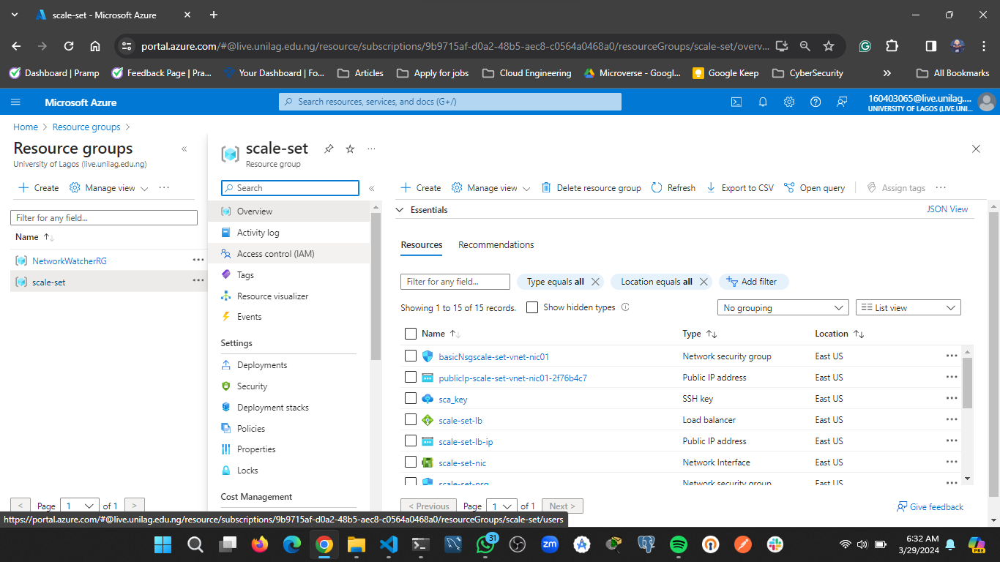

# azure-vmss

Virtual machine scale sets allows you to create identical virtual machine. The number of VM instances can automatically increase or decrease based on scheduled conditions

## Walkthrough
- Create a resource group for the resources

- Create a Virtual Network with a defualt subnet

- Create a network security group accepting incoming ssh, http and https request from 
my computer ip address. Attach to virtual network

- Create a Virual machine scale set with a mininmum of 1 instance and can auto scale to two instance 

- Create a load balance with public ip address

- Create network interfaces to attach to the VMs

N:B I could only create a maximum of two instance on the VMSS because my student subscription only gives 3 public IP adresses
- one for the lb and the remaining two for the instances 

- SSH into the VM and installed apache server 